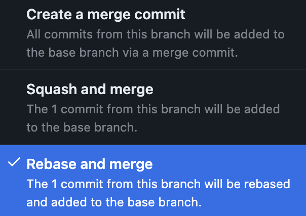

# Git Guidelines


---


:::tip
**Assumption**

* Upstream repo is named `origin`
* The tracked remote branch has the same name as the local branch

:::

# Before you collaborate to any project repo

## Git Author informations

* User Name: Form **must** be same for all services: **Firstname Lastname**
* User Email: **must** be your [penta-b.com](https://penta-b.com) domain

> 💡 **How to Configure:**
>
> To set this information globally, use the following. 
>
> ⚠️ This will be applied to your future commits on all your git projects
>
> \
> `git config --global user.name "Firstname Lastname"`
>
> `git config --global user.email firstname.lastname@penta-b.com`


✨ **Recommendation**

To easily handle multiple identities, it is highly recommended to create a config file only for this purpose and apply this config to a directory where you store all penta-b's git project.

**Example**: If I store all my penta-b's projects in `~/Developer/penta-b/`

I create a file called `~/.gitconfig.penta-b` where I define my identity then call it in the config file

```bash
// filename: ~/.gitconfig.penta-b

[user]
	name = Firstname Lastname
	email = firstname.lastname@penta-b.com
```

```bash
// filename: ~/.gitconfig
// at the end of the file

[includeIf "gitdir:~/Developer/penta-b/"]
path = ~/.gitconfig.penta-b
```

# Branches

### Naming:


1. Should use hyphens '**-**' as words separator
2. Should be in lowercase
3. Should be short and descriptive
4. Should start with backlog full **ticket-id**

   
   1. Example: `full: ET-1074`
5. Should be the same as backlog **ticket-name** (if applicable)


:::info
☝ If the name is too long because of the **ticket-name**, apply rule **(3)** and copy the new name to the **ticket-name** in the backlog (Description in Jira)

:::

> 💡 Naming Example : `$ git checkout -b YWEB-66-redirect-user-to-content-according-to-its-location`


### Lifecycle

* Create a branch from its parent regarding backlog
* Delete the branch from the upstream repository after it's merged.
  * Unless there is a specific reason not to.
  * Command to get merged branches: `$ git branch --merged`

# Create a new Branch

Before any branch creation, you **must** update and sync the repo with the upstream one by fetching.

* `git fetch` if you only want to sync
* `git fetch --prune` if you also want to remove remote-tracking refs that no longer exist on the remote

So this will update the repo and let you know if you are in sync or not with the remote

We assume you are already in the right branch, if not: `git checkout my_branch`

If you are not in sync, there is 2 possibilities

* You don't care about the differences on your local branch `git reset --hard origin/my_branch`
* You care about the changes on local branch `git pull` deal with conflicts, if you have `git push`

### Messages

A commit message is a string, where:

* The first line represents the title of the commit
* Followed by a blank line to separate from the description
* The rest of the message is the description of the commit, what the commit does in imperative tense (thing that happens when applying the commit)
* Title must start by the Jira issue key \[PROJECT-ISSUE_ID\]

```none
Title

Description
```

### Commit

* Title is limited to 80 chars without key part (when possible)
* Capitalise first word of title and sentence
* Limit each line of the description to 120 char
* Add the **#PR-Reference** at the end of the title like (#123)

```none
[YWEB-70] Add support to plain text file (#170)

Update file handling to support .txt files
Update related unit tests
```

# Pull Request

### Before making a PR

* **Maintain self-respect:**

  Make sure to prepare a clean sheet, squash unnecessary steps commits, reorder them, check and/or update title and description, etc. Basically, do an interactive rebase and clean before exposing your work to audience. Command `git rebase -i <1st commit -1>`
* **Respect team efforts:**

  Make sure your work conforms to the team/project style guide
  * Make sure that linters passes
  * Make sure that other guidelines that are not yet checked automatically passes
* **Keep team hyped**

  Make sure application is building correctly

  Make sure that required test passes before you create a PR , otherwise it will be rejected either manually or automatically. This leads , and you'll just waste colleagues time and affect motivation

### Request a review

* **Respect the reviewer:** Explain what the PR does

# Merge


:::tip
There are 2 ways of merging:

* **commit** merge: Is a merge that creates a commit to combine both branches. If there is any conflict between the 2 branches, they will be resolved in that commit. This is an always available merge option.
* **fast-forward** merge: Is a merge without creating new commit. It's just moving a branch reference forward to the top commit of the mergeable branch, that's why we call it a fast-forward merge. This is only available if the mergeable branch is on top of the branch receiving the merge

:::

### Merge Strategy

* Before merging a branch or creating a pull/merge request:
  * Rebase the branch on top of the parent one (the one you want to merge into)

  ```none
  💻 Example: I want to merge my-branch in my-parent-branch, assuming origin is the upstream 
  repository name
  
  [branch-x] $ git checkout my-branch 
  [my-branch] $ git fetch 
  [my-branch] $ git rebase origin/my-parent-branch
  ```
* Commit merge
  * Fast-Forward merge

The strategy for commit is simple

* If a branch contains **one commit** do a **fast-forward merge**.

  

  
:::info
  **On GitHub:**

  **Rebase and merge** option doesn't' give you a chance to edit the commit message, so you need to make sure it is well formatted with the right informations like the PR reference (#PR)

  :::
* If a branch contains **multiple commits**, do a **merge-commit.** `$ git merge --no-ff my-branch`

### Recommendation

* Make sure that you have your editor of choice set as the default editor for git, to be able to set the commit message in best conditions

  ```bash
  // filename: ~/.gitconfig
  // Setting vscode as default editor
  
  [core]
    editor = code --wait
  ```


### FAQs

* When to merge PRs? How many approvals? who needs to validate/merge?
  * > * 2 **minimum** review, for the current sprint, the first within 24h, the second 48h
    > * The owner of the branch is responsible for the merge to the main
    > * Merging with a rebase on top of the destination branch (document and demo for the team)
    > * What are we expecting from a code review?
    >   * Knowledge sharing
    >   * Guidelines
